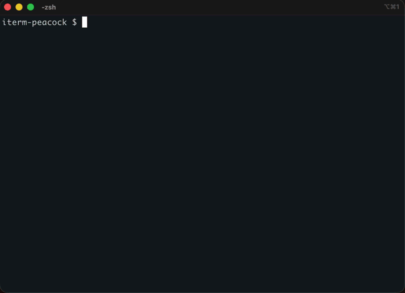

# iterm-peacock

Drop a `.peacock` file in a directory and iTerm2 changes its background, text, tab
color and badge as soon as you cd into it. Leave the directory and everything goes
back. `ssh`, `mysql` and any other command can carry their own colors too, so
production never looks like staging. A zsh plugin; bash works too.



## Install

### zsh

```zsh
git clone https://github.com/sunanana/iterm-peacock ~/.zsh/iterm-peacock
echo 'source ~/.zsh/iterm-peacock/iterm-peacock.plugin.zsh' >> ~/.zshrc
source ~/.zshrc
```

### bash

```bash
git clone https://github.com/sunanana/iterm-peacock ~/.zsh/iterm-peacock
cat >> ~/.bashrc <<'EOF'
source ~/.zsh/iterm-peacock/iterm-peacock.sh
PROMPT_COMMAND="_peacock_precmd${PROMPT_COMMAND:+; $PROMPT_COMMAND}"
_peacock_wrap_commands
EOF
source ~/.bashrc
```

## Usage

```zsh
iterm-peacock
```

## Resolution

The nearest `.peacock` found by walking up from the current directory wins.

```
~/src/
├── .peacock              # background=#2a0d0d
├── api/
│   ├── .peacock          # background=#0d2a1a
│   └── internal/
└── docs/
```

| Current directory | Applied |
| :-- | :-- |
| `~/src` | `~/src/.peacock` |
| `~/src/api` | `~/src/api/.peacock` |
| `~/src/api/internal` | `~/src/api/.peacock` |
| `~/src/docs` | `~/src/.peacock` |
| `~` | none — the profile colors are restored |

## Commands

One `.ini` per command, in `~/.config/iterm-peacock/`. The presence of `mysql.ini` is
what makes `mysql` hooked, and while the command runs its colors are in effect.

```ini
# ~/.config/iterm-peacock/mysql.ini

[prod-db-* *.prod.example.com]
background=#300000
badge=PRODUCTION

[staging-db-*]
background=#000030
```

Patterns are matched against every word of the command line except the command itself
and words starting with `-`, so a host, a profile or a database name is picked up
without this tool knowing each command's options.

```
mysql -h prod-db-01 -u app mydb    prod-db-01 matches, the terminal turns red
psql -h db.staging.example.com     no section matches, nothing changes
```

When a word is not enough — tunnels that all connect to `127.0.0.1` and differ only by
port — a section can match on option values instead. Every condition has to hold, and
the section with the most conditions wins; on a tie, the one written last.

```ini
[PROD]
match-options = -h|--host=127.0.0.1 -P|--port=13306
background=#300000
```

`iterm-peacock help cmd` spells out the rules, written so a coding agent can follow them.

`ssh` is the exception: its option grammar is known, so only the destination is
matched and ssh has to hold the terminal — a login and a tunnel (`ssh -N -L 8080:localhost:80 host`)
are colored, while `ssh host ls` and `-f` are left alone.

```zsh
iterm-peacock cmd                                   # every command and its sections
iterm-peacock cmd mysql prod-db-01                  # what that word would get
iterm-peacock cmd mysql test -h 127.0.0.1 -P 13306  # what that command line would get
iterm-peacock cmd mysql set 'prod-db-*'             # pick a scheme for that section
iterm-peacock cmd mysql set 'prod-db-*' badge PROD  # set one key
iterm-peacock cmd mysql unset 'prod-db-*'           # remove that section
iterm-peacock cmd mysql edit                        # open mysql.ini in $EDITOR
```

`set` is create-or-update, so running it twice leaves the same file, and `unset` is the
only thing that removes anything — the same verbs the `.peacock` side uses.

In zsh a `preexec` hook watches the command line, so no command is wrapped; bash wraps
them, as the install snippet above does.

## Help

```
iterm-peacock --help
```

## Supported Terminal

iTerm2 Only